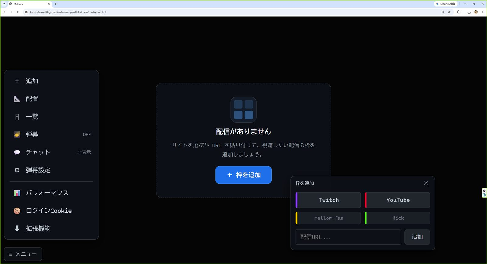
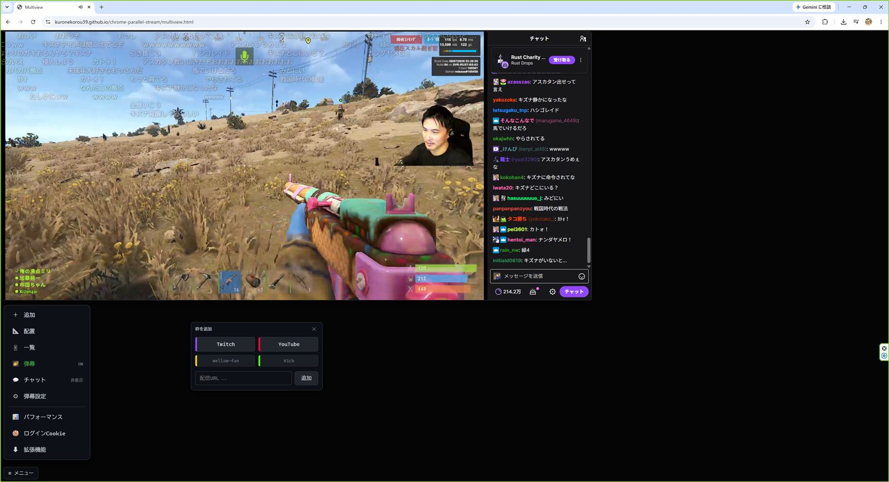
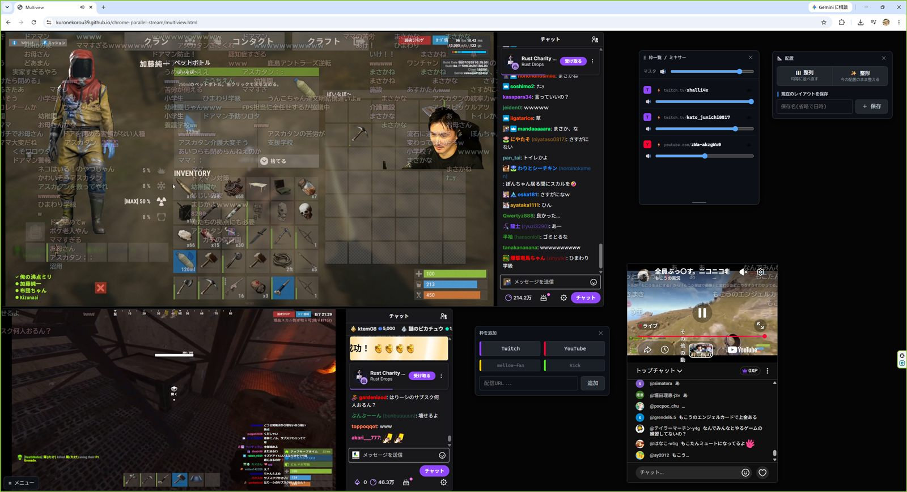
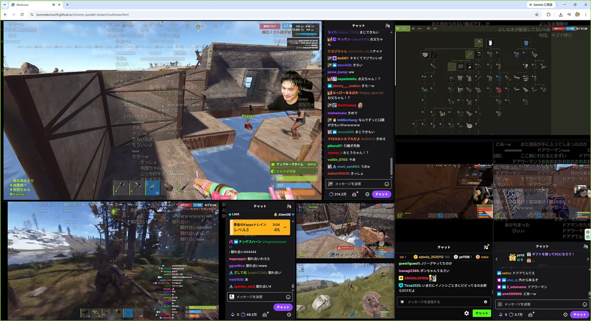

# Parallel Stream

Twitch / YouTube / mellow-fan(旧 OPENREC) / Kick の配信を、1画面にタイル表示して同時に見るための Chrome 拡張機能です。
枠ごとの音量調整、コメント弾幕、レイアウト保存、スマホ向けの縦積み表示に対応しています。

素の JavaScript のみで、ビルド不要・npm 依存なしです。Manifest V3。

---

## 画面

サイトを選ぶか URL を貼って、枠を1つずつ足していきます。

| | |
| --- | --- |
|  |  |
| **枠を追加** — `≡` メニューから、サイトのボタンか URL で | **1枠** — 映像・チャット・弾幕(コメントを映像の上に流す) |
|  |  |
| **4枠** — 枠一覧で音量、配置パネルで整列 | **さらに追加** — 大きさと位置は枠ごとに自由 |

---

## できること

- **マルチビュー** — 配信ページを枠(iframe)として並べ、自由配置またはタイル整列で同時視聴
- **枠ごとの音量** — サイト側のプレイヤー UI に触らず、各枠の音量とミュートをまとめて制御
- **コメント弾幕** — 枠のチャットを取得して映像の上に流す(Twitch ライブ/VOD・YouTube ライブ・mellow-fan)
- **レイアウト保存** — 枠の URL・位置・サイズ・音量を名前付きで保存して呼び出す
- **縦積みモード** — スマホ向けに全幅タイルを縦に並べる

Kick のみ、サイトを埋め込まず [hls.js](https://github.com/video-dev/hls.js) で HLS を直接再生します。

---

## インストール

UI は [GitHub Pages](https://kuronekorou39.github.io/chrome-parallel-stream/multiview.html) で配信して
いますが、**そのページを開くだけでは動きません。拡張機能のインストールが必須です。**

配信サイトは `X-Frame-Options` で iframe 埋め込みを拒否しており、これを解除できるのは拡張機能だけです。
枠ごとの音量制御・弾幕のチャット取得も、拡張機能が枠の中へ注入する content script が担っています。

1. このリポジトリをクローンする
2. Chrome で `chrome://extensions` を開き、「デベロッパーモード」を ON
3. 「パッケージ化されていない拡張機能を読み込む」で、`manifest.json` があるディレクトリを選ぶ
4. ツールバーのアイコン → 「マルチビューを開く」

拡張機能が見つからない状態で UI ページを開いた場合は、画面上部にその旨の警告が出ます。

---

## インストールする前に

配信サイトを iframe で並べるという性質上、通常の拡張機能より踏み込んだことをしています。

- 対象サイトへのサブフレームリクエストから **`X-Frame-Options` を除去**します
- 枠の中でログイン状態を使うため、対象サイトの **Cookie を `SameSite=None` に書き換え**ます
  (**ブラウザ全体に永続します**。設定で OFF にでき、変更前の状態へ戻せます)
- 枠の中に限り、**ページの可視状態を「常に可視」で固定**します(バックグラウンドでも再生を止めないため)
- `host_permissions` に **`<all_urls>`** を要求します

それぞれ何のために・どこまで影響するのかは **[ブラウザに与える影響](docs/browser-impact.md)** に書いてあります。
インストール前に読んでください。

---

## ドキュメント

| | |
| --- | --- |
| [ブラウザに与える影響](docs/browser-impact.md) | ヘッダ操作・Cookie・可視状態の偽装・権限の詳細 |
| [設計メモ](docs/design.md) | UI を通常のオリジンに置いている理由と、ページ⇔拡張の橋渡し |

---

## ライセンス

[MIT](LICENSE)

同梱しているサードパーティコードとその表示は [THIRD-PARTY-NOTICES.md](THIRD-PARTY-NOTICES.md) を参照してください。
